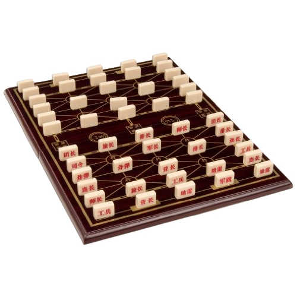
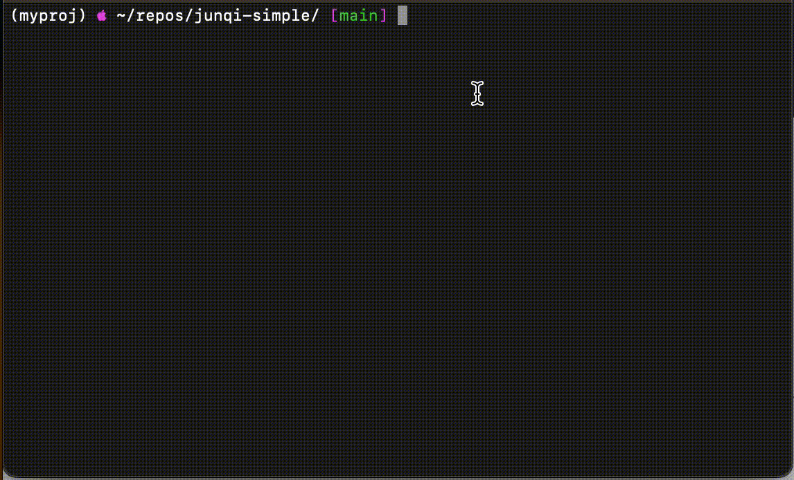
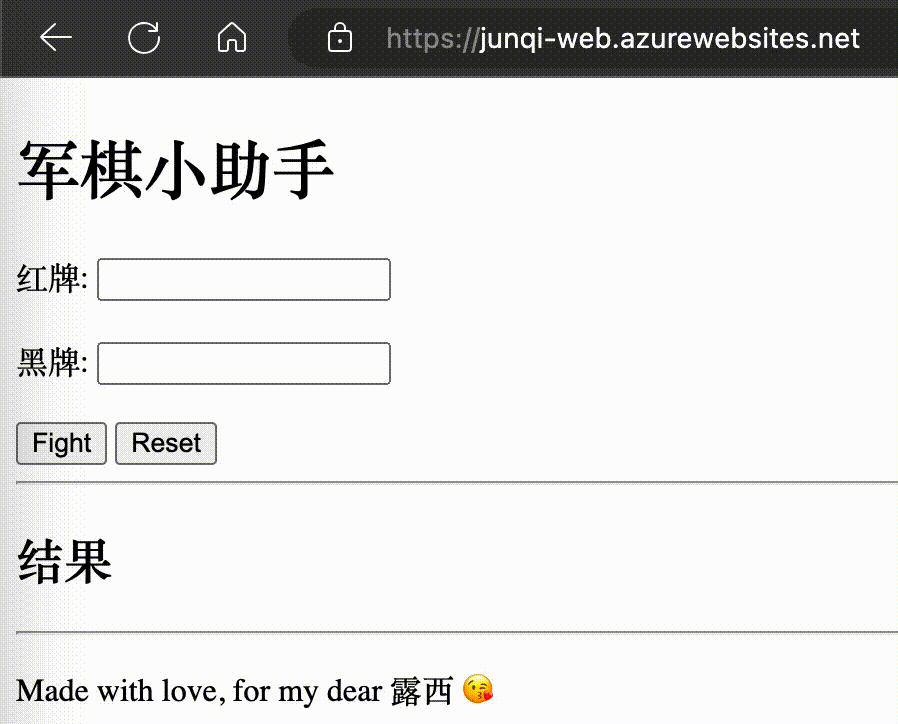

# Miltary Chess (军棋) Helper

## Inspiration

:::tip Interesting!
Anecdotally I have noticed that many popular games (both sports and board-games) in asian culture are two-player games, while popular games in western culture seem to be multi-player.
:::

One of my girlfriend's favourite board games, 军棋, pronounced "jew-n ch-ee", is a traditional chinese, 2-player, highly-tactical board game that challenges both players to play a game of war **without ever knowing each other's pieces**. 

## Basic Rules
Players start with 25 "cards" each of various "sizes" (you can see the relative sizes of each card below), and you usually play the game as shown in the picture above. You can enter a "duel" when you move one of your pieces into the space of one of your opponents', and the larger "size" piece will eat the other piece and stay. 

### The "Judge"
Because neither player is allowed to know each other's pieces, a **third-party** must compare the sizes of the cards during a duel, and discard the smaller piece. The players will see the result of the duel, and have to guess over-time which pieces were which. This unique twist keeps both players in the dark for *the entire game*.

**This project builds a web-based "judge" for couples to use when you don't have a third person but still want to play.**

### The "Cards"

| Card (Chinese) | Card (English/Pinyin) | Name in the App |
| :------------: | :-------------------: | :-------------: |
|       军旗      |  **ju**n **qi**       |       juqi      |
|       工兵      |  **go**ng **bi**n     |       gobi      |
|       排长      |  **pa**i **zh**ang    |       pazh      |
|       连长      |  **li**an **zh**ang   |       lizh      |
|       团长      |  **tu**an **zh**ang   |       tuzh      |
|       旅长      | lu (**lv**) **zh**ang |       lvzh      |
|       营长      |  **yi**ng **zh**ang   |       yizh      |
|       师长      |  **sh**i **zh**ang    |       shzh      |
|       军长      |  **ju**n **zh**ang    |       juzh      |
|       司令      |  **si** **li**ng      |       sili      |
|       炸弹      |  **zh**a **da**n      |       zhda      |
|       地雷      |  **di** **le**i       |       dile      |

### Rules, Sizes, and Setup

You can find out a lot more about specific rules, how to setup, and even how to "judge" pieces [here](https://baike.baidu.com/item/%E5%86%9B%E6%A3%8B/331209?fr=aladdin#:~:text=%E5%9C%B0%E9%9B%B7%E5%90%84%E4%B8%89%E3%80%82-,%E5%90%83%E5%AD%90%E8%A7%84%E5%88%99,-%E5%8F%B8%E4%BB%A4%3E%E5%86%9B%E9%95%BF).

## Project

I created two forms of "judges", one as a CLI tool and another as a website deployed on Azure. To use these "judges", players will take turns and input their 4-digit card name as in the third column of the table above, then the "judge" will share the result of the duel.

### CLI Demo

### Website Demo

