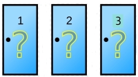
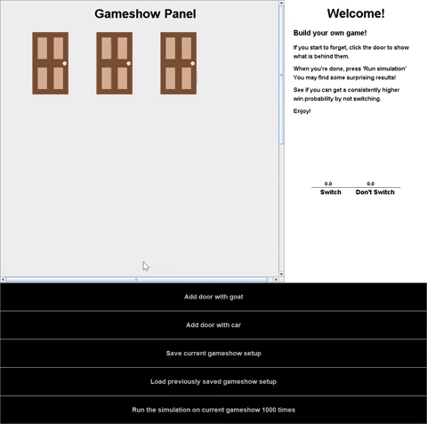
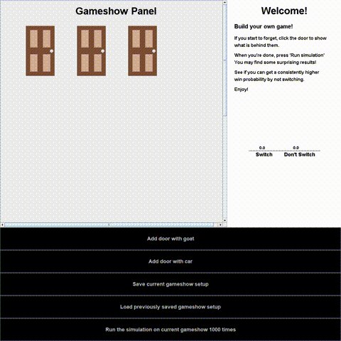

# A Monty Hall Simulator

## Inspiration

In my STAT 302: Introduction to Probability course, we talked about the Monty Hall game show problem. To read more about the setup of the game, you can visit: <https://statisticsbyjim.com/fun/monty-hall-problem/>. Very briefly, the game runs as follows:

There are three doors to pick from. Two of them have a goat behind it, and one of them has a brand-new car behind it. The door you pick corresponds to the item you are bringing home.

### Example Gameshow Snippet

Monty Hall (the game show host) tells you "Pick a door!".

I am a contestant, and let's say I pick door 1. Monty Hall, upon hearing this, opens door 3 and reveals that there is a goat behind that door.

Now, **the key question** is he asks "would you like to switch to door 3? Or would you like to stick with door 1?" This is where the contestants make their final decision, and where the probability question begins.

### The Answer

By applying probability concepts, we can show the counterintuitive result that **switching doors actually leads to a doubled chance of winning the car compared to not switching**. You can see a well-written explanation [here](https://www.statisticshowto.com/probability-and-statistics/monty-hall-problem/).

## Project Goal

 I wanted to build a simulation to compare *switching* and *not switching* over thousands of simulated games, calculate the probabilities, and show this empirically.

My application is a dashboard where you can extensively learn the Monty Hall problem interactively. It will include:

- The default game that is the classic Monty Hall problem
- Customizable game scenarios that can be built through adding doors of your choice
- Clickable doors to check the prize behind certain doors
- Functionality to run a simulation of your custom-built game scenario 1000 times and comparing the performance of "switching"
  vs "not switching".
  
This project was inspired by the avid mathematics tutor/teacher in me. Through this application, I want to extend my help to students who may struggle with math in one way or another with this concept.

## Demo

:::info
You can find the code for this web-app on [the github repo](https://github.com/tommysteryy/Monty-Hall-Simulator/).
:::

### Default Game

### Custom Game & Saving

